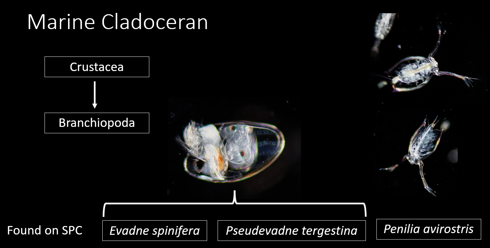
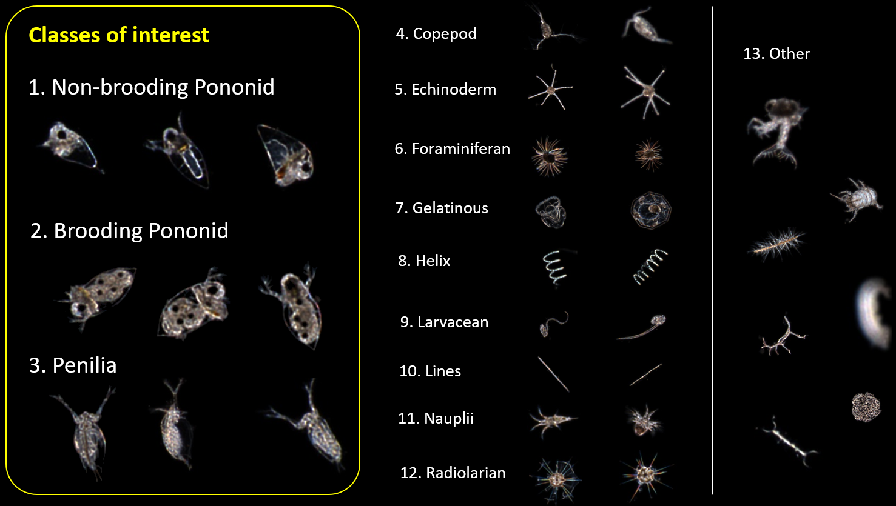
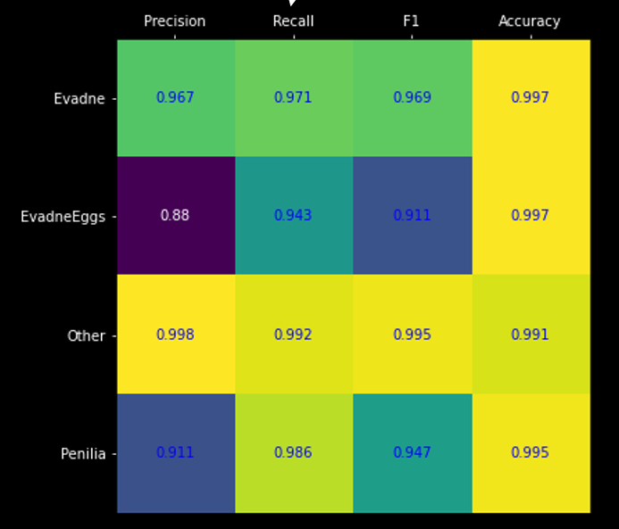

# Zooplankton Image Classification with SPC_ML

The code here is for training and deploying zooplankton classification models using convolutional neural networks in Pytorch.

# Introduction
## What is SPC?
The  <a href="http://spc.ucsd.edu/">Scripps Plankton Camera (SPC) </a> is an underwater microscope system that continuously collects in situ images of plankton at Scripps Pier, La Jolla, CA. Currently, there are more than a billion images of plankton that need to be analyzed for scientific results. 

## Marine Cladoceran
The goal of the SPC_ML project is to determine the abundance of marine Cladoceran from the SPC images. This abundance data will be coupled with other environmental parameters to determine the driver of this biological dynamic. 

# Software Setup

There are two software packages needed for this project.
1. <a href="https://github.com/plertvilai/spici">SPICI</a>: a framework for handling the data from the SPC server. Please follow the link to the SPICI repository and follow the instruction on installation. 
2. SPC_ML: this deep learning framework with Pytorch is the main part of this repository. The only requirement is Pytorch 1.0.1 or higher. Please follow the installation instruction on the <a href="https://pytorch.org/get-started/locally/">Pytorch</a> website. We strongly recommend using GPUs.

# Pre-trained Model

We supply a pre-trained model for marine Cladoceran classification in the `models` folder. The model itself has 13 classes as shown below. However, only the classes of interest are verified and validated for accuracy. 

# Deployment
There are three iPython notebooks available in the `ipython` folder for the deployment of SPC_ML.

## Model Training
For training a new model, follow the notebook `Pytorch Model Training.ipynb`. The code is written to run on Goolge Colab, but it can also be run on a local machine. 

## Running classification
Since there is a conflict in packages for SPICI and SPC_ML, two separate environments are needed. Make sure to create one environment for SPICI and the other for SPC_ML. 
1. Run `SPICI_Run.ipynb` in the SPICI environment. This script will download images from the SPC server to the local machine. The dates of interest should be set in this script. 
2. Run `SPC_ML_Run.ipynb` in the SPC_ML environment. This script will classify images from the local folder generated by the SPICI script and then save the result in a CSV file.